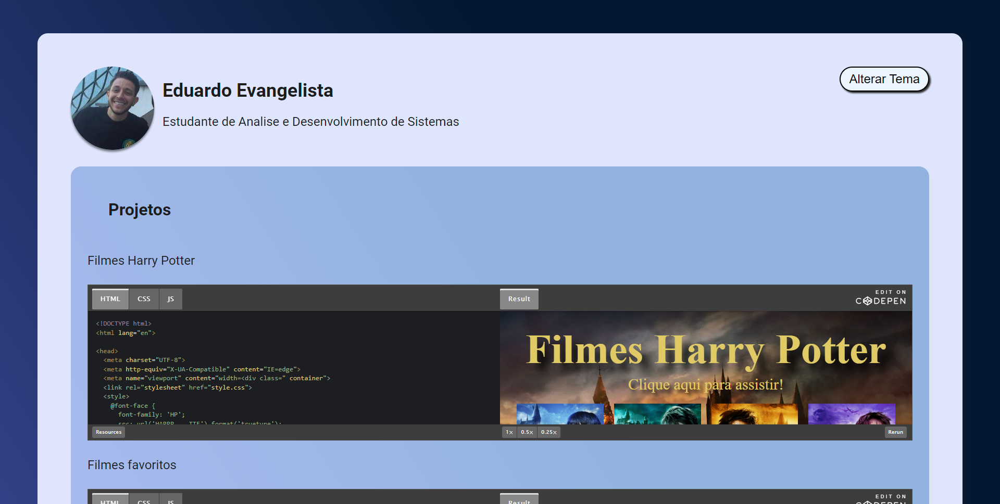

# Projetos Imersão Alura

> Projetos criados no CodePen

Construido no evento da Alura.

🔗[Clique aqui para acessar](https://eduevangelista.github.io/ImersaoAluraProjetos/)

## 🛠 Tecnologias   

- Java Script
- HTML
- CSS
- Git e Github

## Conhecimentos adquiridos no Java Script

- Funções
- Estruturas de repetição
- Arrays
- Tabelas
- Desestruturação de objetos
- Estruturas condicionais

## Contato
- eduevangelista99@gmail.com
- (11) 95933-1973
